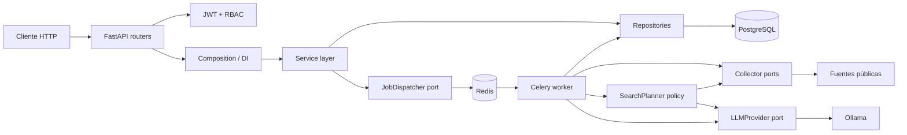

# Arquitectura

## Principios

El proyecto conserva separación de responsabilidades, inversión de
dependencias en los bordes externos y transacciones controladas desde la capa
de servicios. Los controladores HTTP no ejecutan SQL ni llaman proveedores
directamente.

## Capas

| Capa | Responsabilidad | No debe hacer |
|---|---|---|
| `app/api` | HTTP, validación de transporte, códigos de estado | SQL o reglas de negocio |
| `app/dependencies` | Composición FastAPI | Lógica de dominio |
| `app/services` | Casos de uso, políticas, transacciones | Parsear HTTP |
| `app/repositories` | Consultas SQLAlchemy 2.0 | Autorizar acciones |
| `app/models` | Mapeo ORM e invariantes persistentes | Conocer FastAPI |
| `app/schemas` | Contratos Pydantic | Abrir sesiones de BD |
| `app/osint` | Puertos y adaptadores de recolección | Persistencia directa |
| `app/llm` | Puerto LLM, adaptadores y prompts | Promover inferencias a hechos |
| `app/workers` | Adaptación Celery y ejecución asíncrona | Exponer HTTP |

## Autorización

La autorización tiene dos niveles acumulativos:

1. RBAC global valida capacidades como `evidence:create`.
2. La capa de servicio valida acceso contextual al proyecto.

Roles de proyecto:

| Rol | Lectura | Edición | Miembros |
|---|---:|---:|---:|
| viewer | Sí | No | No |
| editor | Sí | Sí | No |
| owner | Sí | Sí | Sí |

Los superusuarios omiten ambas comprobaciones RBAC por diseño. Su uso debe ser
excepcional y auditable.

## Consistencia transaccional

Los repositorios hacen `flush`, pero las confirmaciones pertenecen a servicios.
Las operaciones compuestas —por ejemplo desactivar un usuario y revocar sus
sesiones— comparten la misma sesión SQLAlchemy y se confirman juntas.

Los trabajos asíncronos usan una transacción corta para marcar `running` y una
unidad de trabajo atómica para persistir todos los elementos recolectados junto
con el resultado final. Un fallo revierte el lote y conserva el trabajo como
`failed` con un error truncado.

## Extensibilidad

- Nuevo colector: implementa `Collector` y regístralo en `CollectorRegistry`.
- El planificador sólo selecciona colectores; validación, argumentos y ejecución
  permanecen en código determinista.
- Nuevo LLM: implementa `LLMProvider` y amplía `build_llm_provider`.
- Nueva cola: implementa `JobDispatcher` sin cambiar los casos de uso.
- Nuevo almacenamiento de archivo: debe exponerse como puerto; no debe
  incrustarse en routers o modelos de negocio.
