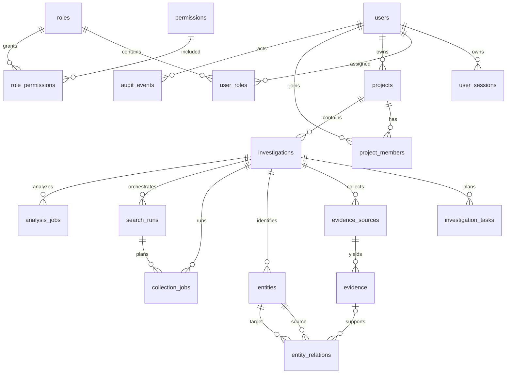

# Modelo de datos

Todas las tablas heredan `id`, `created_at` y `updated_at`. Los timestamps son
con zona horaria y se almacenan en UTC.

## Identidad

- `users`: identidad, estado, borrado lógico y cambio de contraseña.
- `user_sessions`: hash del refresh token, JTIs, expiración y revocación.
- `roles`, `permissions`, `user_roles`, `role_permissions`: RBAC global.

Los tokens nunca se almacenan en claro. El borrado de usuario es lógico y
revoca sesiones.

## Proyectos e investigaciones

- `projects`: propietario, slug único, estado y descripción.
- `project_members`: rol contextual `viewer`, `editor` u `owner`.
- `investigations`: tipo de objetivo, modo operativo, estado, prioridad, autor
  y reglas de engagement opcionales. Las investigaciones heredadas se migran a
  `attack_surface`.
- `investigation_tasks`: asignación, vencimiento y finalización.

Eliminar físicamente un proyecto está fuera del API actual. Archivar conserva
trazabilidad.

## Evidencia y grafo

- `evidence_sources`: origen, colector, localizador y metadatos de procedencia.
- `evidence`: contenido normalizado, JSON crudo, timestamps y SHA-256.
- `entities`: identidad canónica dentro de una investigación.
- `entity_relations`: relación dirigida, confianza y evidencia opcional.

La unicidad de evidencia está limitada a una investigación. El mismo dato puede
ser pertinente en investigaciones distintas sin crear acoplamiento entre casos.

## Trabajos y auditoría

- `collection_jobs`: consulta normalizada, intentos, estado y evidencia creada.
- `search_runs`: objetivo, blancos normalizados, política, plan de Ollama,
  resumen y estado agregado; enlaza los `collection_jobs` hijos.
- `analysis_jobs`: proveedor, versión de prompt, salida y requisito de revisión.
- `audit_events`: actor, acción, tipo/ID de recurso y metadatos no sensibles.

Estados de trabajo individuales: `queued`, `running`, `succeeded`, `failed`.
Una orquestación también admite `partial` cuando unas fuentes terminan y otras
fallan por cuota o disponibilidad.

La cobertura actual registra proyectos/membresías, investigaciones/tareas,
evidencia/entidades/relaciones y ciclo de jobs. Login, cambios de identidad y
administración RBAC todavía no emiten `audit_events`; antes de producción deben
incorporarse a una bitácora con retención y acceso definidos.

## Política de JSON

Los campos JSON aceptan únicamente valores serializables. No deben contener
tokens, contraseñas, cookies, claves privadas o cuerpos binarios. PostgreSQL
continúa siendo la fuente de verdad; Redis solo transporta identificadores de
trabajo.
